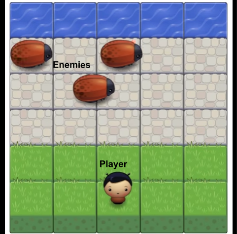

# Arcade game



## Game Description

Archade game similiar to the classic Frogger arcade game. The win the game, the Player must cross the road to reach the water on the top of the screen without colliding with any Enemies(Bugs) in between.  If the Player collides with any of the Enemies, it will have to start from the beginning and try again. Once reaching the water, a message will appear with the option to play the game again.

## Getting Started
Open the following link in your browser.

[Starts game](https://l-colbert.github.io/frontend-nanodegree-arcade-game/)

### Prerequisites

In my HTML file...
```
    <link rel="stylesheet" href="css/style.css">
    <link rel="stylesheet prefetch" href="https://maxcdn.bootstrapcdn.com/font-awesome/4.6.1/css/font-awesome.min.css">
    <script src="js/resources.js"></script>
    <script src="js/engine.js"></script>
    <script src="js/app.js"></script>

```

### HOW TO PLAY

Use the keyboards arrow keyst to move the player around the board


## Authors
* **Libby Colbert** - *Initial work* - [L-Colbert](https://github.com/L-Colbert)

## Contributing

## Acknowledgments

[https://www.w3schools.com/howto/howto_css_modals.asp]